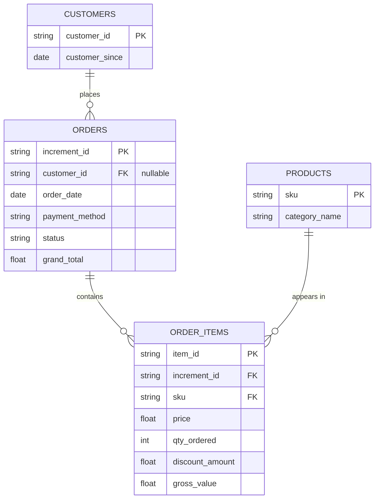

# E-Commerce SQL Analytics Project (OLTP → OLAP Pipeline)
🇬🇧 [English](README.md) | 🇺🇦 [Українська](README.uk.md)

## Overview
This project walks through a full analytics workflow on a real, undocumented e-commerce transactional dataset - starting from raw data validation (discovering encoding artifacts, order-vs-item level financial fields, and inconsistent categorization), through building a normalized OLTP schema in PostgreSQL, to SQL-based KPI/RFM/cohort analysis, an Excel reporting layer, and a final OLAP star-schema model designed for Power BI.

## Tools & Stack
- Docker (PostgreSQL 18, database containerization)
- DBeaver - database management
- Excel + Power Query - dashboards and visualization
- Power BI - planned (OLAP)
- Git / GitHub - version control

## Project Status
- [x] Data quality audit (raw dataset validation, findings documented)
- [ ] OLTP normalization (3NF schema, PK/FK, indexes) - *in progress*
- [ ] SQL analytics layer (window functions, cohort retention, RFM)
- [ ] Excel reporting layer
- [ ] Power BI dashboard (OLAP star schema)

## Key Findings
- Discovered `grand_total` is order-level, not item-level - required recalculating item revenue from `price × qty - discount`
- Found `grand_total = 0` on `complete` orders tied to `customercredit`/`productcredit` payment methods (likely an internal loyalty/credit system), affecting 1.27% of orders
- Chose not to reverse-engineer the exact mechanism given low materiality, but excluded these amounts from financial metrics (AOV, revenue) to avoid understating them
- Identified two separate types of non-customer accounts requiring exclusion: 5 accounts using internal-only payment methods, and 68 accounts whose entire order history consisted of internal QA/test SKUs (`test-product`, etc.) - together confirming this dataset required active filtering of non-customer noise, not just cleanup of malformed values
- Cash-on-delivery accounts for 44.63% of all orders - a signal of low trust in cashless payments in this market
- Investigated an undocumented ` MV ` column suspected to be a distinct gross-value metric - confirmed it was a rounded, lower-precision duplicate of `price × qty`, and computed the value directly instead
- [Full audit trail](docs/findings.md)

## Architecture
The project is built on three PostgreSQL schemas, separating raw data from analytical models:


`staging` (raw TEXT columns, 1:1 with CSV) →   
`oltp` (normalized 3NF schema: `customers`, `products`, `orders`, `order_items`) →  
analytical SQL `VIEW`s (`v_monthly_kpi`, `v_rfm_segments`, `v_cohort_retention`) →   
Excel (Power Query) / Power BI (`olap` star schema - planned).

### ER Diagram (OLTP Layer)



**Why 3NF first instead of a star schema right away:** A normalized model ensures data integrity during the SQL/Excel analysis phase; the dimensional layer is added later specifically to optimize DAX time intelligence in Power BI.

## Repository Structure
```
├── sql/
│   ├── 01_setup_and_staging.sql
│   ├── 02_data_quality_checks.sql
│   ├── 03_normalization.sql
│   ├── 04_indexes.sql
│   ├── 05_analysis_business.sql
│   ├── 06_analysis_financial.sql
│   ├── 07_analysis_marketing.sql
│   └── 08_cohort_analysis.sql
├── docs/
│   ├── findings.md
│   └── exploration-log.md
├── excel/
│   └── dashboard.xlsx
├── screenshots/
│   └── excel/
│   └── power-bi/
├── .gitignore
├── README.md
└── README.uk.md
```

## How to Reproduce

1. Download the dataset from Kaggle: [Pakistan's Largest E-Commerce Dataset](https://www.kaggle.com/datasets/zusmani/pakistans-largest-ecommerce-dataset)
2. Start PostgreSQL via Docker:
```bash
docker run --name pakistan-ecommerce-db \
  -e POSTGRES_PASSWORD=your_password \
  -p 5432:5432 \
  -v postgres-data:/var/lib/postgresql \
  -d postgres:18
```
3. Run `sql/01_setup_and_staging.sql` to create the schemas and staging table.
4. Import the CSV into `staging.pakistan_largest_ecommerce_dataset` - via DBeaver's Data Transfer Wizard (right-click the table → Import Data), or by uncommenting the `COPY`/`\copy` command inside `01_setup_and_staging.sql`.
5. Run the remaining SQL scripts from `sql/` in numeric order.
6. Open `excel/dashboard.xlsx` and refresh the Power Query connections (Data → Refresh All).