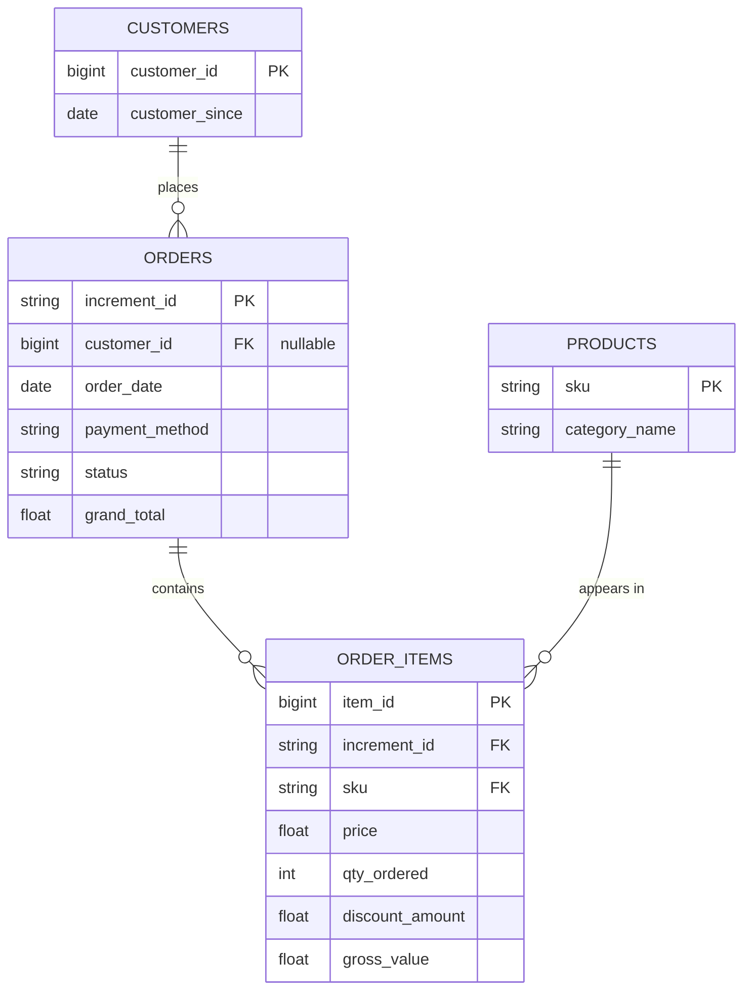

# Проєкт з SQL-аналітики та моделювання даних електронної комерції (Пайплайн OLTP → OLAP)
🇬🇧 [English](README.md) | 🇺🇦 [Українська](README.uk.md)

## Огляд
Цей проєкт демонструє повний робочий процес аналітики на реальному, недокументованому наборі транзакційних даних електронної комерції - починаючи від валідації сирих даних (виявлення артефактів кодування, фінансових полів на рівні замовлення проти рівня товару, а також неузгодженої категоризації), через застосування принципів реляційного проєктування баз даних (нормалізація 3NF, обмеження PK/FK, референційна цілісність) для побудови нормалізованої OLTP-схеми в PostgreSQL, до розрахунку KPI/RFM/когортного аналізу за допомогою SQL, створення шару звітності в Excel та фінальної моделі "зірка" (star schema) в OLAP, розробленої для Power BI.

## Інструменти та стек
- Docker (PostgreSQL 18, контейнеризація бази)
- DBeaver - робота з базою
- Excel + Power Query - дашборд і візуалізація
- Power BI - заплановано (OLAP)
- Git / GitHub - контроль версій

## Статус проєкту
- [x] Аудит якості даних (валідація сирого датасету, висновки задокументовано)
- [ ] Нормалізація OLTP (схема 3NF, PK/FK, індекси) - *в процесі*
- [ ] Шар SQL-аналітики (віконні функції, утримання когорт, RFM)
- [ ] Шар звітності в Excel
- [ ] Дашборд Power BI (схема "зірка" OLAP)

## Ключові знахідки
- Виявлено, що `grand_total` належить рівню замовлення, а не товару - знадобився перерахунок виручки товару через `price × qty − discount`
- Виявлено `grand_total = 0` для замовлень зі статусом complete, пов'язане зі способами оплати customercredit/productcredit (ймовірно внутрішня бонусна/кредитна система), що стосується 1.27% замовлень
- Вирішено не розкривати точний механізм через низьку матеріальність, але суми виключено з фінансових метрик (AOV, виручка), щоб їх не занижувати
- Ідентифіковано два окремі типи неклієнтських акаунтів, що потребували виключення: 5 акаунтів із виключно внутрішніми способами оплати, і 68 акаунтів, чия вся історія замовлень складалась із тестових SKU (`test-product` тощо) - разом підтверджуючи, що датасет вимагав активної фільтрації неклієнтського шуму, а не лише очищення биту даних
- Оплата при отриманні (COD) - 44.63% усіх замовлень, сигнал низької довіри до безготівкових платежів на ринку
- Досліджено недокументовану колонку ` MV `, яка спершу здавалась самостійною метрикою - підтверджено, що це округлена, менш точна копія `price × qty`, і замінено на прямий розрахунок
- [Повний звіт з аудиту](docs/findings.md)

## Архітектура
Проєкт побудований на трьох PostgreSQL-схемах, що розділяють сирі дані й аналітичні моделі:

`staging` (сирі TEXT-колонки, 1:1 з CSV) →   
`oltp` (нормалізована 3NF-схема: `customers`, `products`, `orders`, `order_items`) →  
аналітичні SQL `VIEW` (`v_monthly_kpi`, `v_rfm_segments`, `v_cohort_retention`) →   
Excel (Power Query) / Power BI (`olap`, зірка - заплановано).

### ER-діаграма (шар OLTP)



**Чому спочатку 3NF, а не одразу зірка:** нормалізована модель гарантує цілісність даних під час SQL/Excel-аналізу; dimensional-шар додається пізніше саме для оптимізації DAX time intelligence в Power BI.

## Структура репозиторію 
```
├── sql/
│   ├── 01_setup_and_staging.sql
│   ├── 02_data_quality_checks.sql
│   ├── 03_normalization_oltp.sql
│   ├── 04_indexes.sql
│   ├── 05_analysis_business.sql
│   ├── 06_analysis_financial.sql
│   ├── 07_analysis_marketing.sql
│   └── 08_cohort_analysis.sql
├── docs/
│   ├── findings.md
│   └── exploration-log.md
├── excel/
│   └── dashboard.xlsx
├── screenshots/
│   ├── excel/
│   └── power-bi/
├── .gitignore
├── README.md
└── README.uk.md
```

## Як відтворити

1. Завантажте датасет з Kaggle:  [Pakistan's Largest E-Commerce Dataset](https://www.kaggle.com/datasets/zusmani/pakistans-largest-ecommerce-dataset)
2. Запустіть PostgreSQL через Docker:
```bash
docker run --name pakistan-ecommerce-db \
  -e POSTGRES_PASSWORD=your_password \
  -p 5432:5432 \
  -v postgres-data:/var/lib/postgresql \
  -d postgres:18
```
3. Виконайте скрипт `sql/01_setup_and_staging.sql` для створення схем та staging-таблиці.
4. Імпортуйте CSV у `staging.pakistan_largest_ecommerce_dataset` - за допомогою Data Transfer Wizard у DBeaver (правий клік на таблиці → Import Data), або розкоментувавши команду `COPY`/`\copy` всередині `01_setup_and_staging.sql`.
5. Виконайте решту SQL-скриптів з теки `sql/` у числовому порядку.
6. Відкрийте `excel/dashboard.xlsx` та оновіть підключення Power Query (Дані → Оновити все / Data → Refresh All).